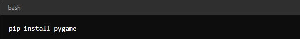
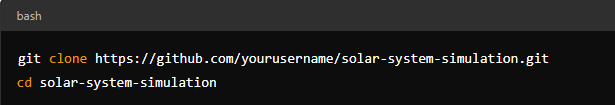
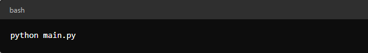
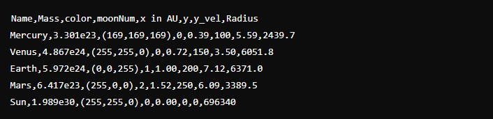

# -*- coding: utf-8 -*-

Created on Sat Aug  3 19:13:38 2024

## Authors
* [Emmanuel Ouang-namou Adoum](https://github.com/adoumouangnamouemmanuel)
* [Rachel](https://github.com)

  

  

# Solar System Simulation
## Overview
The Solar System Simulation project is a Python-based simulation of the solar system, utilizing Pygame for visualization and various calculations for accurate celestial physics. The project aims to provide an educational tool to explore planetary dynamics, including gravitational interactions, orbital mechanics, and visualization.

## Table of Contents
1. Installation
2. Usage
3. Project Structure
4. Classes and Functions
5. Logging and Error Handling
6. CSV Export
7. Physics Behind the Simulation
8. Future Enhancements
9. Contributing
10. License
### 1. Installation
#### Prerequisites
Ensure you have Python 3.8 or later installed. You will also need the following Python libraries:

* `pygame` for rendering the simulation.\
You can install these libraries using pip:

#### Cloning the Repository
Clone the repository to your local machine:

### 2. Usage
#### Running the Simulation
To run the simulation, execute the `main.py` script. This will load the planet data from a CSV file and visualize the solar system using Pygame.

#### Data File
Ensure you have a CSV file named data.csv in the working directory with the following columns:

* `Name`: Name of the planet.
* `Mass`: Mass of the planet (in kilograms).
* `color`: Color of the planet in RGB format (e.g., (255, 0, 0) for red).
* `moonNum`: Number of moons.
* `x in AU`: Distance from the Sun in Astronomical Units (AU).
* `y`: Initial y-coordinate.
* `y_vel`: Initial velocity in the y-direction (in km/s).
* `Radius`: Radius of the planet.

#### Example CSV Format

### 3. Project Structure
* `main.py`: The entry point for the simulation. Loads the planet data and runs the Pygame loop.
* `planet.py`: Contains the Planet class for representing planets and performing physics calculations.
* `Sun.py`: contains the Sun class representing the Sun
* `Moon.py`: Contains the Moon class representing the Moon
* `data.csv`: The CSV file containing the planet data.
* `Star`: contains the Star Class
* `load_data.py`: Defines the load_file function for loading planet data from CSV files.
* `decorators.py`: Includes decorators for logging function calls and measuring execution time.
* `logger.py`: Configures logging for the application.

### 4. Classes and Functions
#### Planet Class
Represents a celestial body with attributes and methods for calculating physical properties and drawing itself in Pygame.

* Attributes: x, y, radius, color, mass, name, numMoons, distance, etc.
* Methods:
    * `getVolume()`: Calculates the volume of the planet.
    * `getDensity()`: Calculates the density of the planet.
    * `getSurfaceArea()`: Calculates the surface area of the planet.
    * `getCircumference()`: Calculates the circumference of the planet.
    * `getGravity()`: Calculates the surface gravity of the planet.
    * `getOrbitalPeriod()`: Calculates the orbital period of the planet.
    * `getEscapeVelocity()`: Calculates the escape velocity of the planet.
    * `getOrbitalVelocity()`: Calculates the orbital velocity of the planet.
    * `draw(win)`: Draws the planet on the Pygame window.
    * `attraction(other)`: Calculates the gravitational attraction between this planet and another.
    * `update_position(planets)`: Updates the planet's position based on gravitational forces.
    * `add_moon(moon)`: Adds a moon to the planet.
    * `export_to_csv(filename)`: Exports planet attributes and calculated values to a CSV file.
### 5. Logging and Error Handling
* `Logging`: Configured to log function entries, exits, and execution time using decorators. Errors during file operations are also logged.
* `Error Handling`: Handles exceptions during file reading, Pygame initialization, and CSV writing.
### 6. CSV Export
* The `export_to_csv` method in the Planet class writes the planet’s attributes and computed values to a CSV file. This includes volume, density, surface area, circumference, gravity, orbital period, escape velocity, and orbital velocity.

### 7. Physics Behind the Simulation
The Solar System Simulation models celestial mechanics and gravitational interactions based on classical physics principles. Below are detailed explanations of the physical processes and calculations used in the simulation:
#### 1. Gravitational Attraction
**Newton's Law of Universal Gravitation**

The gravitational force `F` between two celestial bodies is calculated using Newton's law of universal gravitation:
\[ F = G \frac{m_1 m_2}{r^2} \]\
Where:
* G is the gravitational constant: `6.67430×10 −11m^3kg^−1s^−2`
* `m_1` and `m_2` are the masses of the two celestial bodies
* `d` is the distance between the centers of the two celestial bodies

**Force Decomposition**\
The force is decomposed into x and y components using trigonometric functions. If the angle between the line connecting the two bodies and the x-axis is 𝜃:\
Fx = F.cos(𝜃)\
Fy = F.sin(𝜃)\
where:
* Fx and Fy are the components of the gravitational force along the x and y axes, 
* θ is calculated using the atan2 function to determine the angle based on the relative positions of the bodies.
#### 2. Orbital Mechanics
**Orbital Velocity**

The orbital velocity v required for a body to maintain a circular orbit around another body is given by:\
`v = sqrt(G.M / r)`\
where:
* `G` is the gravitational constant,
* `M` is the mass of the central body,
* `r` is the distance from the central body to the orbiting body.

This formula ensures that the centripetal force required for circular motion is provided by the gravitational attraction.

**Orbital Period**

The orbital period T of a planet in a circular orbit is calculated using:\
`T = 2 * pi * sqrt(r^3 / (G * M))`

where:
* `r` is the semi-major axis of the orbit (approximated as the average distance for circular orbits),
* `M` is the mass of the central body.

This formula derives from Kepler’s third law, which states that the square of the orbital period is proportional to the cube of the semi-major axis.

#### 3. Updates and Time Steps
**Force Calculation**

At each time step, the simulation calculates the gravitational forces between all pairs of planets. This involves:

* Iterating over all planet pairs,
* Calculating the gravitational force between them using the formula above,
* Decomposing this force into x and y components.

**Velocity Update**

The acceleration a experienced by a planet is determined by:\
ax = Fx / m

ay = Fy / m

vnew = vold + a*Δt

where `Δt` is the time step.

### 8. Future Enhancements
* `Interactive UI`: Add interactive controls to manipulate simulation parameters.
* `Advanced Physics`: Include more detailed gravitational interactions and relativistic effects.
* `Moons Visualization`: Implement and visualize moon orbits around planets.
* `Real-time Data`: Fetch and display real-time planetary data from online sources.
### 9. Contributing
Contributions are welcome! Please fork the repository and submit pull requests with improvements or bug fixes. Ensure your changes are well-documented and tested.

### 10. License
All rights reserved
